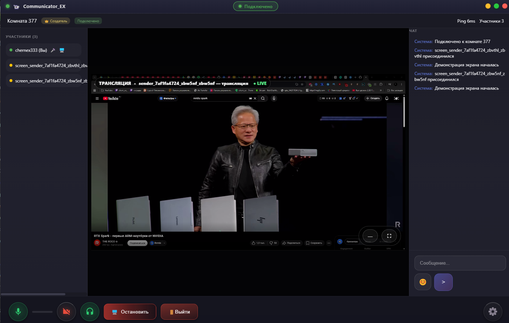
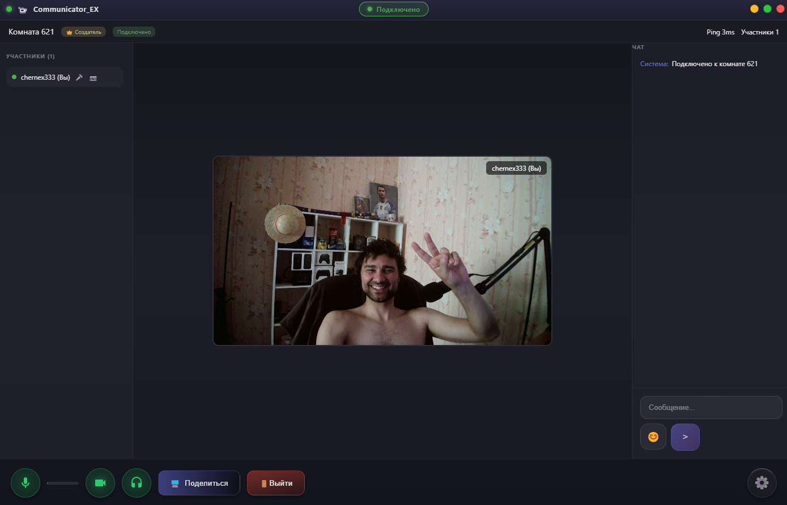

# Communicator EX

<p align="center">
  
  
  
  
</p>

<p align="center">
  <strong>An open-source, high-performance real-time communication platform focused on secure voice, video, and ultra-low-latency desktop screen sharing.</strong>
</p>

<p align="center">
  🌐 <a href="http://communicator-ex.ru/"><strong>Official Website</strong></a> | 📢 <a href="https://t.me/chern_ex"><strong>Active Telegram Community</strong></a>
</p>

---

## 🖥️ Project Showcase

<p align="center">
  
  
  
  
</p>

<p align="center">
  <em>Application Interface: Standalone Client Dashboard | 1080p Screen Sharing | Call Infrastructure | Webcam Video Conference</em>
</p>

---

## 🎯 About & Core Philosophy

**Communicator EX** is a next-generation desktop communication environment engineered from the ground up to challenge heavy corporate alternatives. By combining a native-like desktop runtime with a robust Go-based WebRTC signaling ecosystem, the platform delivers enterprise-grade media transmission while maintaining absolute data ownership through self-hosted deployments.

### Key Highlights
* **High-FPS Media Capture:** Native desktop streaming supporting hardware acceleration.
* **Privacy by Design:** Zero reliance on forced third-party cloud infrastructure for demo evaluation or core data routing.
* **AI-Ready Architecture:** Designed with modular pipelines to seamlessly integrate advanced LLMs and automated voice/text assistants directly into communication channels.

---

## ⚡ Current Features (Production Ready & Tested)

The core architecture has been thoroughly load-tested under simulated and real-world conditions with up to **20 simultaneous active participants**, demonstrating absolute stability, low jitter, and consistent packet routing.

* **🔒 Dynamic Room Management:**
  * **Custom Room Creation:** Users can instantly provision isolated communication spaces.
  * **Password-Protected Rooms:** Hardened authorization layer allowing hosts to secure rooms with custom access credentials.
  * **Automated Cleanup (Auto-Destruction):** Advanced room lifecycle management. Empty or inactive rooms are permanently pruned from the memory stack after **30 seconds of zero activity** to optimize server resources and maintain privacy.
* **🎙️ Real-Time Audio Communication:** Low-latency voice channels utilizing optimized audio codecs with built-in echo cancellation and noise suppression.
* **📹 High-Definition Video Calls:** Native webcam capture with adaptive bitrate streaming to ensure visual clarity even on constrained network nodes.
* **🖥️ Multi-Quality Desktop Screen Sharing:** Native display capturing pipeline supporting multiple target profiles to balance bandwidth and performance:
  * **1080p @ 30 FPS** (High-Fidelity Desktop Presentation)
  * **720p @ 30 FPS** (Balanced Media Streaming)
  * **480p @ 30 FPS** (Low-Bandwidth Optimization Layer)

---

## 🛠️ Technology Stack

The project utilizes a modern, decoupled stack optimized for low resource consumption and massive throughput:

* **Frontend & Client Runtime:** Electron, React, HTML5, CSS3 (Modern component-driven UI with cross-platform optimization)
* **Real-Time Media Transport:** WebRTC protocol suite (Secure peer-to-peer and SFU routing)
* **Signaling & Media Backend:** Pion (High-performance Go-based WebRTC implementation)
* **Media Processing Core:** FFmpeg integration (On-the-fly hardware-accelerated encoding/decoding)
* **Environment Control:** Node.js (Robust backend toolchain and local environment orchestration)

---

## 🚀 Future Roadmap & Planned Innovations

We are actively evolving the ecosystem to bridge the gap between traditional chat applications and next-generation decentralized collaboration tools.

### 📱 Ecosystem Expansion
* **Native Android Client:** Development of a high-performance Android mobile application utilizing native WebRTC bindings to allow seamless cross-platform communication between Windows and mobile devices.
* **60 FPS Media Pipeline Upgrade:** Upgrading current screen-capturing layers to support rock-solid **1080p @ 60 FPS** execution for fluid gaming demonstrations and heavy media processing.
* **Ultra-HD 2K/4K Rooms:** Provisioning massive throughput pipelines to support high-resolution broadcast rooms.

### 📂 Advanced Product Features
* **P2P & Hybrid File Transfer:** Implementation of high-speed local and remote file sharing directly through WebRTC Data Channels, ensuring end-to-end encryption without passing data through external cloud storage.
* **Native Offline Meeting Recording:** Hardware-accelerated local recording layer built into the client, enabling users to save high-quality streams directly to their hard drives without taxing server infrastructure.
* **Loyalty & Tenure Progression:** Automated user verification badges, custom profile customization (animated canvas backgrounds), and long-term registration milestone trackers.

### 🟣 Next-Gen AI Integration Layer (The OpenAI Milestone)
* **AI Media Summaries:** Intelligent audio-transcription layer designed to parse ongoing voice meetings and convert long audio sessions into concise, bulleted text summaries for offline users.
* **Automated Channel Moderation:** Deploying advanced LLM nodes via API to monitor text channels for malicious links, automated spam patterns, and coordinate real-time hardware-ID tracking to permanently neutralize malicious actors.
* **Smart Local AI Companions:** Modular plugin pipeline allowing users to deploy standalone, text-to-speech automated assistants directly inside community channels.

---

## 📦 Distribution & Setup

Communicator EX is distributed as a standalone desktop binary (`.exe`). You can download the pre-compiled standalone package directly via the **Releases** section on the right.

```bash
# Clone the repository
git clone [https://github.com/chernex/Communicator_EX.git](https://github.com/chernex/Communicator_EX.git)

# Navigate to the project directory
cd Communicator_EX
